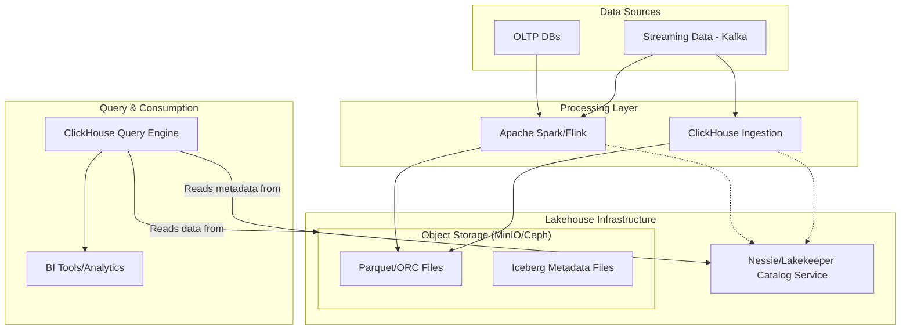

#  ClickHouse compatibility with Iceberg

[ClickHouse](https://www.google.com/search?q=ClickHouse&sca_esv=8dfe9edb86176f37&rlz=1C1GCHN_enAR1179AR1179&sxsrf=AE3TifNhep9j2v_7iB1cu3ItVue2qSlcgw%3A1764817831175&ei=p_swaafACuHJ1sQP0qef6A4&ved=2ahUKEwjzwsf5-qKRAxU6qZUCHTZpO7QQgK4QegQIARAC&uact=5&oq=clickhouse+is+compatible+with+Lakehouse+&gs_lp=Egxnd3Mtd2l6LXNlcnAiKGNsaWNraG91c2UgaXMgY29tcGF0aWJsZSB3aXRoIExha2Vob3VzZSAyBRAhGKABSMBCUMsIWNM8cAF4AZABAJgBtwKgAZUsqgEJMC4xOC4xMS4xuAEDyAEA-AEBmAIfoAL_LMICChAAGEcY1gQYsAPCAg0QABiABBiKBRhDGLADwgIFEAAYgATCAg4QLhiABBjHARivARiOBcICChAAGIAEGIoFGEPCAggQABiABBjLAcICDhAuGIAEGMsBGMcBGNEDwgIGEAAYFhgewgIIEAAYgAQYogTCAgUQABjvBcICBBAhGBWYAwCIBgGQBgqSBwkxLjE4LjExLjGgB7husgcJMC4xOC4xMS4xuAf1LMIHBjEuMjMuN8gHQw&sclient=gws-wiz-serp&mstk=AUtExfBwCSrJ_YtUR6OoKiIR8uw657jKAYA6112DJt4-oiSMVC2Bq4SA_nRMZb9MPY5Nze8kGuW5STvLFhxvaTR9m97DncNc4M9QcGLB_YzfdLkl3UoKFOhkEqAWRCnTfkW_DnynksHuhZAwD3YyKkBkeJHbz9uqQiM714rsTk_hiTTfJmmvbbad8MgcujOMQcc-n3FUTp3cXhuM2YSyOoS-GGnMsFxlfZLIYu5Iwq6ZqcimYC5aH8Lz25dZjk1KI1jEP9c2mscGlW3Z8W-FDtnCgBBy&csui=3) is compatible with the [lakehouse](https://www.google.com/search?q=lakehouse&sca_esv=8dfe9edb86176f37&rlz=1C1GCHN_enAR1179AR1179&sxsrf=AE3TifNhep9j2v_7iB1cu3ItVue2qSlcgw%3A1764817831175&ei=p_swaafACuHJ1sQP0qef6A4&ved=2ahUKEwjzwsf5-qKRAxU6qZUCHTZpO7QQgK4QegQIARAD&uact=5&oq=clickhouse+is+compatible+with+Lakehouse+&gs_lp=Egxnd3Mtd2l6LXNlcnAiKGNsaWNraG91c2UgaXMgY29tcGF0aWJsZSB3aXRoIExha2Vob3VzZSAyBRAhGKABSMBCUMsIWNM8cAF4AZABAJgBtwKgAZUsqgEJMC4xOC4xMS4xuAEDyAEA-AEBmAIfoAL_LMICChAAGEcY1gQYsAPCAg0QABiABBiKBRhDGLADwgIFEAAYgATCAg4QLhiABBjHARivARiOBcICChAAGIAEGIoFGEPCAggQABiABBjLAcICDhAuGIAEGMsBGMcBGNEDwgIGEAAYFhgewgIIEAAYgAQYogTCAgUQABjvBcICBBAhGBWYAwCIBgGQBgqSBwkxLjE4LjExLjGgB7husgcJMC4xOC4xMS4xuAf1LMIHBjEuMjMuN8gHQw&sclient=gws-wiz-serp&mstk=AUtExfBwCSrJ_YtUR6OoKiIR8uw657jKAYA6112DJt4-oiSMVC2Bq4SA_nRMZb9MPY5Nze8kGuW5STvLFhxvaTR9m97DncNc4M9QcGLB_YzfdLkl3UoKFOhkEqAWRCnTfkW_DnynksHuhZAwD3YyKkBkeJHbz9uqQiM714rsTk_hiTTfJmmvbbad8MgcujOMQcc-n3FUTp3cXhuM2YSyOoS-GGnMsFxlfZLIYu5Iwq6ZqcimYC5aH8Lz25dZjk1KI1jEP9c2mscGlW3Z8W-FDtnCgBBy&csui=3) architecture and can function as its fast query engine, integrating with open table formats like [Iceberg](https://www.google.com/search?q=Iceberg&sca_esv=8dfe9edb86176f37&rlz=1C1GCHN_enAR1179AR1179&sxsrf=AE3TifNhep9j2v_7iB1cu3ItVue2qSlcgw%3A1764817831175&ei=p_swaafACuHJ1sQP0qef6A4&ved=2ahUKEwjzwsf5-qKRAxU6qZUCHTZpO7QQgK4QegQIARAE&uact=5&oq=clickhouse+is+compatible+with+Lakehouse+&gs_lp=Egxnd3Mtd2l6LXNlcnAiKGNsaWNraG91c2UgaXMgY29tcGF0aWJsZSB3aXRoIExha2Vob3VzZSAyBRAhGKABSMBCUMsIWNM8cAF4AZABAJgBtwKgAZUsqgEJMC4xOC4xMS4xuAEDyAEA-AEBmAIfoAL_LMICChAAGEcY1gQYsAPCAg0QABiABBiKBRhDGLADwgIFEAAYgATCAg4QLhiABBjHARivARiOBcICChAAGIAEGIoFGEPCAggQABiABBjLAcICDhAuGIAEGMsBGMcBGNEDwgIGEAAYFhgewgIIEAAYgAQYogTCAgUQABjvBcICBBAhGBWYAwCIBgGQBgqSBwkxLjE4LjExLjGgB7husgcJMC4xOC4xMS4xuAf1LMIHBjEuMjMuN8gHQw&sclient=gws-wiz-serp&mstk=AUtExfBwCSrJ_YtUR6OoKiIR8uw657jKAYA6112DJt4-oiSMVC2Bq4SA_nRMZb9MPY5Nze8kGuW5STvLFhxvaTR9m97DncNc4M9QcGLB_YzfdLkl3UoKFOhkEqAWRCnTfkW_DnynksHuhZAwD3YyKkBkeJHbz9uqQiM714rsTk_hiTTfJmmvbbad8MgcujOMQcc-n3FUTp3cXhuM2YSyOoS-GGnMsFxlfZLIYu5Iwq6ZqcimYC5aH8Lz25dZjk1KI1jEP9c2mscGlW3Z8W-FDtnCgBBy&csui=3) and reading data directly from cloud storage without requiring extensive data ingestion. It achieves this compatibility through its ability to work with open file formats like [Parquet](https://www.google.com/search?q=Parquet&sca_esv=8dfe9edb86176f37&rlz=1C1GCHN_enAR1179AR1179&sxsrf=AE3TifNhep9j2v_7iB1cu3ItVue2qSlcgw%3A1764817831175&ei=p_swaafACuHJ1sQP0qef6A4&ved=2ahUKEwjzwsf5-qKRAxU6qZUCHTZpO7QQgK4QegQIARAF&uact=5&oq=clickhouse+is+compatible+with+Lakehouse+&gs_lp=Egxnd3Mtd2l6LXNlcnAiKGNsaWNraG91c2UgaXMgY29tcGF0aWJsZSB3aXRoIExha2Vob3VzZSAyBRAhGKABSMBCUMsIWNM8cAF4AZABAJgBtwKgAZUsqgEJMC4xOC4xMS4xuAEDyAEA-AEBmAIfoAL_LMICChAAGEcY1gQYsAPCAg0QABiABBiKBRhDGLADwgIFEAAYgATCAg4QLhiABBjHARivARiOBcICChAAGIAEGIoFGEPCAggQABiABBjLAcICDhAuGIAEGMsBGMcBGNEDwgIGEAAYFhgewgIIEAAYgAQYogTCAgUQABjvBcICBBAhGBWYAwCIBgGQBgqSBwkxLjE4LjExLjGgB7husgcJMC4xOC4xMS4xuAf1LMIHBjEuMjMuN8gHQw&sclient=gws-wiz-serp&mstk=AUtExfBwCSrJ_YtUR6OoKiIR8uw657jKAYA6112DJt4-oiSMVC2Bq4SA_nRMZb9MPY5Nze8kGuW5STvLFhxvaTR9m97DncNc4M9QcGLB_YzfdLkl3UoKFOhkEqAWRCnTfkW_DnynksHuhZAwD3YyKkBkeJHbz9uqQiM714rsTk_hiTTfJmmvbbad8MgcujOMQcc-n3FUTp3cXhuM2YSyOoS-GGnMsFxlfZLIYu5Iwq6ZqcimYC5aH8Lz25dZjk1KI1jEP9c2mscGlW3Z8W-FDtnCgBBy&csui=3), support for open table formats, and direct querying from locations like cloud object storage. 

## How ClickHouse integrates with a Lakehouse

- **Queries open formats:** ClickHouse can query data directly in formats like Parquet, which is the foundation for open table formats like Iceberg and [Delta Lake](https://www.google.com/search?q=Delta+Lake&sca_esv=8dfe9edb86176f37&rlz=1C1GCHN_enAR1179AR1179&sxsrf=AE3TifNhep9j2v_7iB1cu3ItVue2qSlcgw%3A1764817831175&ei=p_swaafACuHJ1sQP0qef6A4&ved=2ahUKEwjzwsf5-qKRAxU6qZUCHTZpO7QQgK4QegQIBBAB&uact=5&oq=clickhouse+is+compatible+with+Lakehouse+&gs_lp=Egxnd3Mtd2l6LXNlcnAiKGNsaWNraG91c2UgaXMgY29tcGF0aWJsZSB3aXRoIExha2Vob3VzZSAyBRAhGKABSMBCUMsIWNM8cAF4AZABAJgBtwKgAZUsqgEJMC4xOC4xMS4xuAEDyAEA-AEBmAIfoAL_LMICChAAGEcY1gQYsAPCAg0QABiABBiKBRhDGLADwgIFEAAYgATCAg4QLhiABBjHARivARiOBcICChAAGIAEGIoFGEPCAggQABiABBjLAcICDhAuGIAEGMsBGMcBGNEDwgIGEAAYFhgewgIIEAAYgAQYogTCAgUQABjvBcICBBAhGBWYAwCIBgGQBgqSBwkxLjE4LjExLjGgB7husgcJMC4xOC4xMS4xuAf1LMIHBjEuMjMuN8gHQw&sclient=gws-wiz-serp&mstk=AUtExfBwCSrJ_YtUR6OoKiIR8uw657jKAYA6112DJt4-oiSMVC2Bq4SA_nRMZb9MPY5Nze8kGuW5STvLFhxvaTR9m97DncNc4M9QcGLB_YzfdLkl3UoKFOhkEqAWRCnTfkW_DnynksHuhZAwD3YyKkBkeJHbz9uqQiM714rsTk_hiTTfJmmvbbad8MgcujOMQcc-n3FUTp3cXhuM2YSyOoS-GGnMsFxlfZLIYu5Iwq6ZqcimYC5aH8Lz25dZjk1KI1jEP9c2mscGlW3Z8W-FDtnCgBBy&csui=3).
- **Supports open table formats:** It has integrations with open table formats such as Iceberg and Delta Lake, enabling it to understand and work with table metadata and features like schema evolution and data versioning.
- **Queries data in place:** It can query data directly from object storage (like cloud storage) without needing to move it into the ClickHouse database first, which reduces data movement and ETL overhead.
- **Provides fast analytics:** By using its vectorized execution and other optimizations, ClickHouse provides fast, real-time analytics on data stored in the lakehouse, ideal for dashboards and AI workloads.
- **Handles data loading:** It can be used for both loading data into ClickHouse for hot data storage and for running queries directly against the data lakehouse.
- **Works with catalogs:** It supports integration with various data lake catalogs, including [Unity Catalog](https://www.google.com/search?q=Unity+Catalog&sca_esv=8dfe9edb86176f37&rlz=1C1GCHN_enAR1179AR1179&sxsrf=AE3TifNhep9j2v_7iB1cu3ItVue2qSlcgw%3A1764817831175&ei=p_swaafACuHJ1sQP0qef6A4&ved=2ahUKEwjzwsf5-qKRAxU6qZUCHTZpO7QQgK4QegQIBBAH&uact=5&oq=clickhouse+is+compatible+with+Lakehouse+&gs_lp=Egxnd3Mtd2l6LXNlcnAiKGNsaWNraG91c2UgaXMgY29tcGF0aWJsZSB3aXRoIExha2Vob3VzZSAyBRAhGKABSMBCUMsIWNM8cAF4AZABAJgBtwKgAZUsqgEJMC4xOC4xMS4xuAEDyAEA-AEBmAIfoAL_LMICChAAGEcY1gQYsAPCAg0QABiABBiKBRhDGLADwgIFEAAYgATCAg4QLhiABBjHARivARiOBcICChAAGIAEGIoFGEPCAggQABiABBjLAcICDhAuGIAEGMsBGMcBGNEDwgIGEAAYFhgewgIIEAAYgAQYogTCAgUQABjvBcICBBAhGBWYAwCIBgGQBgqSBwkxLjE4LjExLjGgB7husgcJMC4xOC4xMS4xuAf1LMIHBjEuMjMuN8gHQw&sclient=gws-wiz-serp&mstk=AUtExfBwCSrJ_YtUR6OoKiIR8uw657jKAYA6112DJt4-oiSMVC2Bq4SA_nRMZb9MPY5Nze8kGuW5STvLFhxvaTR9m97DncNc4M9QcGLB_YzfdLkl3UoKFOhkEqAWRCnTfkW_DnynksHuhZAwD3YyKkBkeJHbz9uqQiM714rsTk_hiTTfJmmvbbad8MgcujOMQcc-n3FUTp3cXhuM2YSyOoS-GGnMsFxlfZLIYu5Iwq6ZqcimYC5aH8Lz25dZjk1KI1jEP9c2mscGlW3Z8W-FDtnCgBBy&csui=3), [AWS Glue](https://www.google.com/search?q=AWS+Glue&sca_esv=8dfe9edb86176f37&rlz=1C1GCHN_enAR1179AR1179&sxsrf=AE3TifNhep9j2v_7iB1cu3ItVue2qSlcgw%3A1764817831175&ei=p_swaafACuHJ1sQP0qef6A4&ved=2ahUKEwjzwsf5-qKRAxU6qZUCHTZpO7QQgK4QegQIBBAI&uact=5&oq=clickhouse+is+compatible+with+Lakehouse+&gs_lp=Egxnd3Mtd2l6LXNlcnAiKGNsaWNraG91c2UgaXMgY29tcGF0aWJsZSB3aXRoIExha2Vob3VzZSAyBRAhGKABSMBCUMsIWNM8cAF4AZABAJgBtwKgAZUsqgEJMC4xOC4xMS4xuAEDyAEA-AEBmAIfoAL_LMICChAAGEcY1gQYsAPCAg0QABiABBiKBRhDGLADwgIFEAAYgATCAg4QLhiABBjHARivARiOBcICChAAGIAEGIoFGEPCAggQABiABBjLAcICDhAuGIAEGMsBGMcBGNEDwgIGEAAYFhgewgIIEAAYgAQYogTCAgUQABjvBcICBBAhGBWYAwCIBgGQBgqSBwkxLjE4LjExLjGgB7husgcJMC4xOC4xMS4xuAf1LMIHBjEuMjMuN8gHQw&sclient=gws-wiz-serp&mstk=AUtExfBwCSrJ_YtUR6OoKiIR8uw657jKAYA6112DJt4-oiSMVC2Bq4SA_nRMZb9MPY5Nze8kGuW5STvLFhxvaTR9m97DncNc4M9QcGLB_YzfdLkl3UoKFOhkEqAWRCnTfkW_DnynksHuhZAwD3YyKkBkeJHbz9uqQiM714rsTk_hiTTfJmmvbbad8MgcujOMQcc-n3FUTp3cXhuM2YSyOoS-GGnMsFxlfZLIYu5Iwq6ZqcimYC5aH8Lz25dZjk1KI1jEP9c2mscGlW3Z8W-FDtnCgBBy&csui=3), and [Hive Metastore](https://www.google.com/search?q=Hive+Metastore&sca_esv=8dfe9edb86176f37&rlz=1C1GCHN_enAR1179AR1179&sxsrf=AE3TifNhep9j2v_7iB1cu3ItVue2qSlcgw%3A1764817831175&ei=p_swaafACuHJ1sQP0qef6A4&ved=2ahUKEwjzwsf5-qKRAxU6qZUCHTZpO7QQgK4QegQIBBAJ&uact=5&oq=clickhouse+is+compatible+with+Lakehouse+&gs_lp=Egxnd3Mtd2l6LXNlcnAiKGNsaWNraG91c2UgaXMgY29tcGF0aWJsZSB3aXRoIExha2Vob3VzZSAyBRAhGKABSMBCUMsIWNM8cAF4AZABAJgBtwKgAZUsqgEJMC4xOC4xMS4xuAEDyAEA-AEBmAIfoAL_LMICChAAGEcY1gQYsAPCAg0QABiABBiKBRhDGLADwgIFEAAYgATCAg4QLhiABBjHARivARiOBcICChAAGIAEGIoFGEPCAggQABiABBjLAcICDhAuGIAEGMsBGMcBGNEDwgIGEAAYFhgewgIIEAAYgAQYogTCAgUQABjvBcICBBAhGBWYAwCIBgGQBgqSBwkxLjE4LjExLjGgB7husgcJMC4xOC4xMS4xuAf1LMIHBjEuMjMuN8gHQw&sclient=gws-wiz-serp&mstk=AUtExfBwCSrJ_YtUR6OoKiIR8uw657jKAYA6112DJt4-oiSMVC2Bq4SA_nRMZb9MPY5Nze8kGuW5STvLFhxvaTR9m97DncNc4M9QcGLB_YzfdLkl3UoKFOhkEqAWRCnTfkW_DnynksHuhZAwD3YyKkBkeJHbz9uqQiM714rsTk_hiTTfJmmvbbad8MgcujOMQcc-n3FUTp3cXhuM2YSyOoS-GGnMsFxlfZLIYu5Iwq6ZqcimYC5aH8Lz25dZjk1KI1jEP9c2mscGlW3Z8W-FDtnCgBBy&csui=3), which helps manage table locations and metadata. 

## How ClickHouse is integrated with a Lakehouse

**ClickHouse is fully compatible with the lakehouse architecture** and is often used as a high-performance query engine for data stored in a data lakehouse. ClickHouse can integrate seamlessly with various components of a modern lakehouse environment. 

Key aspects of its compatibility include:

- **Direct Querying of Open Formats**: ClickHouse can directly query data files in open formats like [Apache Parquet](https://parquet.apache.org/), Apache ORC, and CSV in place, without requiring complex ETL processes or data ingestion into its native format first.
- **Integration with Open Table Formats**: It integrates with open table formats such as [Apache Iceberg](https://iceberg.apache.org/), [Delta Lake](https://delta.io/), and Apache Hudi, supporting features like ACID transactions, schema evolution, and time travel.
- **Catalog Integration**: ClickHouse can connect to metadata catalogs like AWS Glue Catalog, [Databricks Unity Catalog](https://www.databricks.com/product/unity-catalog), and others, allowing it to automatically discover and query lakehouse tables.
- **Object Storage Support**: It offers native support for querying data directly from major cloud object storage platforms, including Amazon S3, Azure Blob Storage, and Google Cloud Storage.
- **Hybrid Architectures**: Many organizations use a hybrid approach where "hot" (frequently accessed) data is stored in ClickHouse's native, high-performance format for sub-second query latency, while "cold" or historical data remains in the more cost-efficient lakehouse storage, with ClickHouse querying both tiers seamlessly. 

In essence, ClickHouse extends the benefits of the data lakehouse (openness, scalability, cost-efficiency) with the speed and performance of a specialized analytical database, enabling real-time analytics on massive datasets within the lakehouse ecosystem. 

## For an on-premise landscape, which is the best catalog solution to integrate with a Lakehouse with Iceberg and ClickHouse? Which will be the architecture?

For an on-premise lakehouse with Iceberg and ClickHouse, **[Project Nessie](https://projectnessie.org/)**, **Lakekeeper**, or the **Apache Hive Metastore (HMS)** are the best catalog solutions. They are open-source, self-managed, and compatible with both technologies. 

- **Project Nessie**: Recommended for its Git-like versioning semantics, which enables advanced data management features like branching and committing data changes. It is an open-source REST catalog implementation for Apache Iceberg.
- **Lakekeeper**: Another open-source option that provides a high-performance Rust native implementation of the Iceberg REST catalog specification, suitable for on-premise deployment.
- **Apache Hive Metastore (HMS)**: A traditional and widely supported option in the Hadoop ecosystem. While it lacks some modern Iceberg-specific features (like multi-table transactions), it's a battle-tested and compatible choice if you already have it in your on-premise landscape. 

ClickHouse integrates with these catalogs via the `DataLakeCatalog` database engine, which connects to external catalogs using the Iceberg REST or Hive API specifications. 

### On-Premise Architecture

The architecture for this setup involves distinct layers for storage, table format/metadata, data processing/querying, and consumption. 

### Storage Layer (On-Premise Object Storage)

- **Description**: This layer provides durable, scalable, and cost-effective storage for all raw data files (e.g., Parquet, ORC) and Iceberg metadata files.

- **Technologies**:

  - **MinIO** or **Ceph**: Common choices for self-hosted, S3-compatible object storage in on-premise environments. 

### Table Format and Catalog Layer

- **Description**: The **Apache Iceberg** table format organizes the data files into logical tables, providing features like ACID transactions, schema evolution, and time travel. The catalog is the central source of truth for tracking table names and their current metadata locations.

- **Technologies**:

  - **Apache Iceberg**: The data table format standard.
  - **Project Nessie / Lakekeeper / Hive Metastore**: The metadata catalog service deployed on-premise. 

### Processing and Query Engine Layer

- **Description**: This layer handles data ingestion, transformation, and high-performance querying.

- **Technologies**:

  - **[ClickHouse](https://clickhouse.com/)**: Serves as the high-performance analytical query engine. It uses the `DataLakeCatalog` engine to connect to the Nessie/Lakekeeper catalog and query the Iceberg tables directly in object storage.
  - **Apache Spark/Flink**: Can be used for large-scale batch ETL or streaming data ingestion/transformation, writing data into the Iceberg tables via the catalog. 

### Consumption Layer

- **Description**: Tools used by end-users for BI, reporting, and ad-hoc analysis.
- **Technologies**:
  - BI Tools (e.g., Tableau, Power BI) connect to ClickHouse via standard interfaces (JDBC/ODBC). 

### Architectural Diagram (Conceptual)

mermaid

